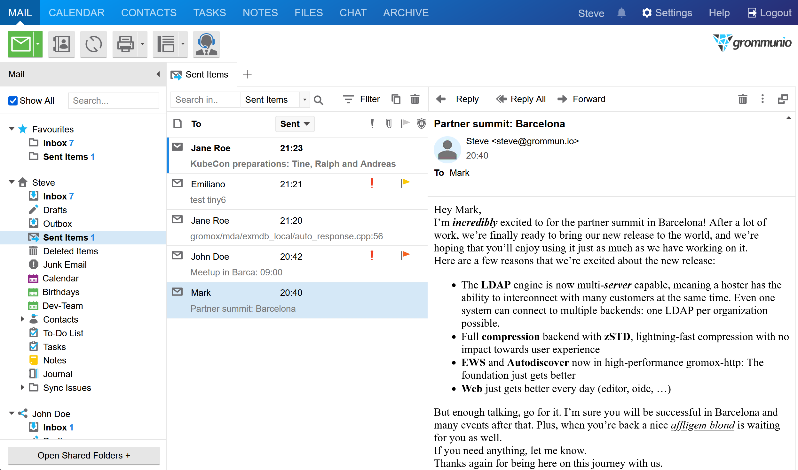
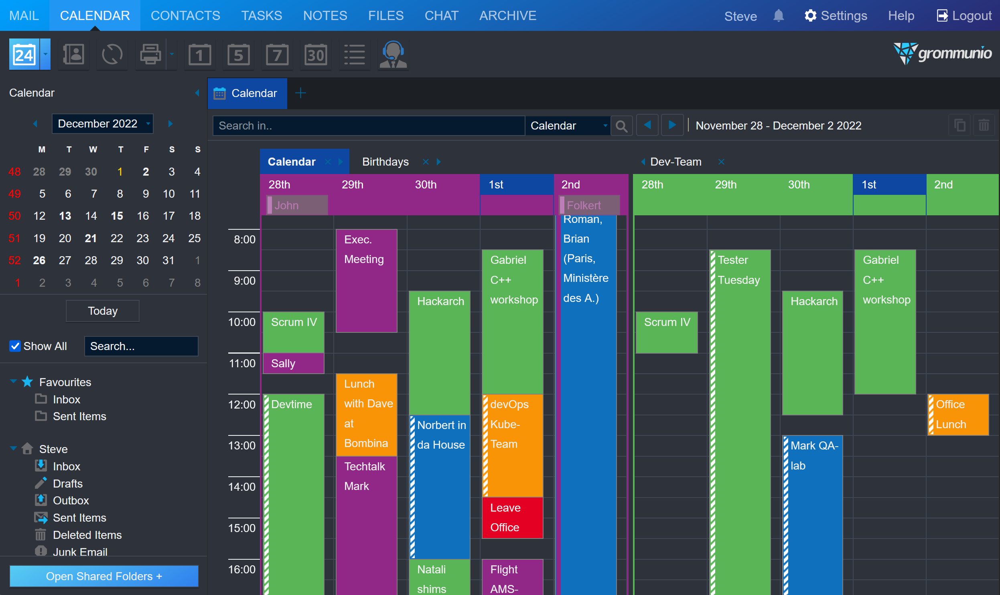

grommunio Web
=============

**grommunio Web is an open-source web application and provides all the familiar
email, advanced calendaring and contact features you need to be productive. It
is the main web application for access to your productivity workspace,
including email, calendar, contacts, tasks, notes and more.**

|shield-agpl| |shield-release|_ |shield-scrut|_ |shield-loc|

.. |shield-agpl| image:: https://img.shields.io/badge/license-AGPL--3.0-green
.. _shield-agpl: LICENSE.txt
.. |shield-release| image:: https://shields.io/github/v/tag/grommunio/grommunio-web
.. _shield-release: https://github.com/grommunio/grommunio-web/tags
.. |shield-scrut| image:: https://img.shields.io/scrutinizer/build/g/grommunio/grommunio-web
.. _shield-scrut: https://scrutinizer-ci.com/g/grommunio/grommunio-web
.. |shield-loc| image:: https://img.shields.io/github/languages/code-size/grommunio/grommunio-web

grommunio Web is also the basis for grommunio Desktop, a cross-platform client
designed to run on your desktop without any specific browser requirements.

At a glance
===========

* Provides web-based groupware (emails, contacts, calendar, tasks and notes)
  connectivity.
* Includes extensions integrating grommunio Meet, Chat Archive and more.
* Compatible, works with any modern web browser such as Chrome, Edge, Firefox,
  Safari and others.
* Easy to use, providing a polished interface with nearly no training required
  for users.
* Distributable, compatible with load balancers such as haproxy, apisix, KEMP
  and others.
* Scalable, capable of running with tens of thousands of sessions concurrently.
* Fast, with a snappy interface which reacts almost immediately to user
  interactions.
* Secure, with certifications through independent security research and
  validation.

Compatibility
=============

* PHP 7.4+, 8.x
* Required modules: json, gd, gettext, mapi, xml
* Required backend: gromox-zcore

Getting started
===============

Prerequisites
-------------

* A working **web server** (nginx is recommended), with a working TLS configuration
* **PHP**, preferably with the FPM executor
* **Zcore** MAPI transport (provided by `Gromox
  <https://github.com/grommunio/gromox>`_)

Installation
------------

* Deploy grommunio-web at a location of your choice, such as
  ``/usr/share/grommunio-web``.
* Validate the configuration file and save to
  ``/etc/grommunio-web/config.php``. Confer with the template in
  `</config.php.dist>`_.
* Adapt web server configuration according to your needs. `</build>`_ provides
  some examples.
* Prepare PHP configuration according to your needs. `</build>`_ provides some
  examples.

Support
=======

Support is available through grommunio GmbH and its partners. See
https://grommunio.com/ for details. A community forum is at
`<https://community.grommunio.com/>`_.

For direct contact and supplying information about a security-related
responsible disclosure, contact `dev@grommunio.com <dev@grommunio.com>`_.

Contributing
============

* https://docs.github.com/en/get-started/quickstart/contributing-to-projects
* Alternatively, upload commits to a git store of your choosing, or export the
  series as a patchset using `git format-patch
  <https://git-scm.com/docs/git-format-patch>`_, then convey the git
  link/patches through our direct contact address (above).

Development
===========

Coding style
------------

This repository follows a custom coding style, which can be validated anytime
using the repository's provided `configuration file <.phpcs>`_.

Setup of the development environment
------------------------------------

To get started, make sure you have a working set of the following components:

* gromox-http
* gromox-zcore
* php-mapi
* nginx

Checkout the repository into a new directory, e.g.
``/usr/share/grommunio-web-dev``.

If you want to use the existing grommunio-web config, point ``config.php`` to
it:

.. code-block:: sh

	ln -s /etc/grommunio-web/config.php /usr/share/grommunio-web-dev/config.php

or use the ``config.php.dist`` file:

.. code-block:: sh

	cp -p /usr/share/grommunio-web-dev/config.php.dist /usr/share/grommunio-web-dev/config.php

If you want to use the existing grommunio-web defaults, copy the ``defaults.php`` file:

.. code-block:: sh

	cp -p /usr/share/grommunio-web/defaults.php /usr/share/grommunio-web-dev/defaults.php

Make sure to adjust ``/usr/share/grommunio-web-dev/defaults.php`` to
use sources instead of the release variant as follows: Search for…

.. code-block:: php

	if (!defined('DEBUG_LOADER')) define('DEBUG_LOADER', LOAD_RELEASE);

and replace it with

.. code-block:: php

	if (!defined('DEBUG_LOADER')) define('DEBUG_LOADER', LOAD_SOURCE);

For debugging purposes it might make sense to enable ``debug.php`` file:

.. code-block:: sh

	cp -p /usr/share/grommunio-web-dev/debug.php.dist /usr/share/grommunio-web-dev/debug.php

At last, adjust (or copy) the nginx config file
``/usr/share/grommunio-common/nginx/locations.d/grommunio-web.conf`` by
replacing

.. code-block:: text

	alias /usr/share/grommunio-web/;

with

.. code-block:: text

	alias /usr/share/grommunio-web-dev/;

After changing the configuration, validate your nginx configuration with
the ``nginx -t`` command and reload with ``systemctl reload nginx``.

Translations
============

For performance reasons, the languages are loaded into the shared memory of the
running system. After changes to the translation files, re-generate the gettext
strings (see ``Makefile``) and make sure you clear the shared memory segment
for the cache:

.. code-block:: sh

	ipcrm -M 0x950412de

The translations are managed through a `Weblate project
<https://hosted.weblate.org/projects/grommunio/grommunio-web/>`_. Contributions
are regularly monitored and integrated in the release cycles of grommunio Web.
