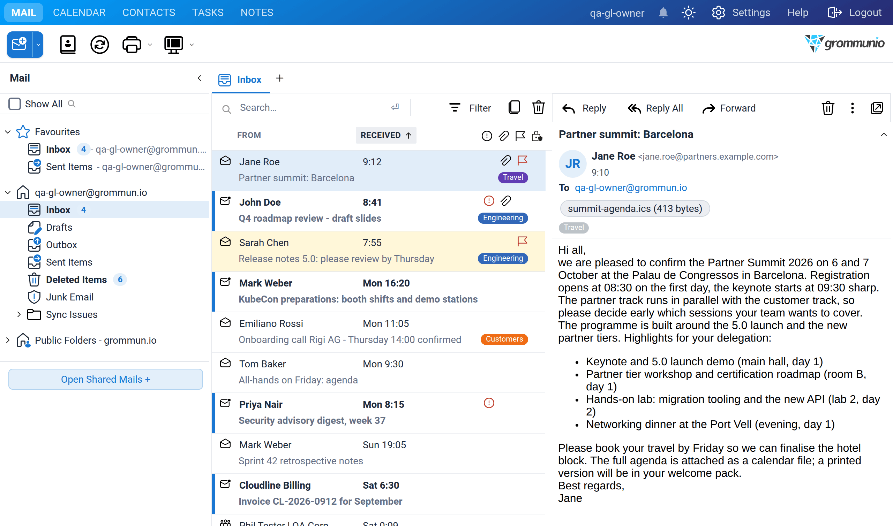
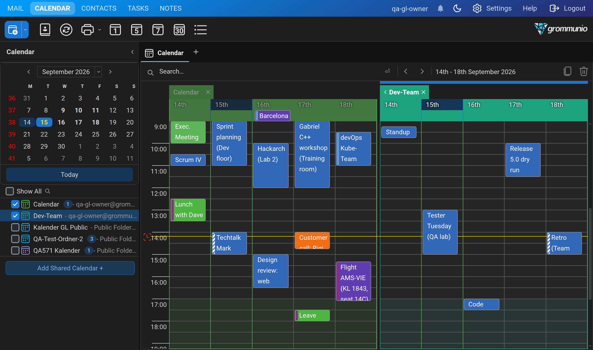

grommunio Web
=============

**grommunio Web is an open-source web application and provides all the familiar
email, advanced calendaring and contact features you need to be productive. It
is the main web application for access to your productivity workspace,
including email, calendar, contacts, tasks, notes and more.**

|shield-agpl| |shield-release| |shield-scrut| |shield-loc| |shield-reuse|

.. |shield-agpl| image:: https://img.shields.io/badge/license-AGPL--3%2E0-green
                 :target: LICENSE.txt
.. |shield-release| image:: https://shields.io/github/v/tag/grommunio/grommunio-web
                    :target: https://github.com/grommunio/grommunio-web/tags
.. |shield-scrut| image:: https://img.shields.io/scrutinizer/build/g/grommunio/grommunio-web
                  :target: https://scrutinizer-ci.com/g/grommunio/grommunio-web
.. |shield-loc| image:: https://img.shields.io/github/languages/code-size/grommunio/grommunio-web
                :target: https://github.com/grommunio/grommunio-web/
.. |shield-reuse| image:: https://img.shields.io/badge/REUSE-compliant-green
                  :target: REUSE.toml

grommunio Web is also the basis for grommunio Desktop, a cross-platform client
designed to run on your desktop without any specific browser requirements.

At a glance
===========

* Provides web-based groupware (emails, contacts, calendar, tasks and notes)
  connectivity, with shared and public folders, delegates, rules, out of
  office, meeting requests and free/busy.
* Light and dark mode, a command palette and keyboard shortcuts for the whole
  interface, and a settings search.
* Signs and encrypts mail with S/MIME and OpenPGP; OpenPGP keys never leave
  the browser.
* Previews attachments and files in place: PDF, Word, Excel and PowerPoint
  documents, OpenDocument, RTF, plain text, images, audio, video and attached
  mails.
* Groups the inbox by conversation on request, with a threaded reading pane.
* Includes extensions integrating grommunio Files (Nextcloud, ownCloud,
  Seafile and any WebDAV server, with OnlyOffice editing), grommunio Meet,
  Chat, Archive, mobile device management, maps and an AI assistant.
* Compatible, works with any modern web browser: Chrome and Edge 109, Firefox
  115, Safari 16 and later. Installs as a progressive web app.
* Easy to use, providing a polished interface with nearly no training required
  for users. Translated into more than 80 languages.
* Distributable, compatible with load balancers such as haproxy, apisix, KEMP
  and others.
* Scalable, capable of running with tens of thousands of sessions concurrently.
* Fast, with a snappy interface which reacts almost immediately to user
  interactions; the deploy tree ships precompressed for brotli and gzip.
* Secure, with certifications through independent security research and
  validation, a published security policy, SPDX headers on every source file
  and a bill of materials with every release.

Compatibility
=============

* PHP 8.2 or later, with the ``mapi`` extension provided by gromox
* Required extensions: gettext, iconv, json, gd, dom, xmlwriter, mbstring,
  zlib, session, sqlite3, openssl, curl, sodium, zip, fileinfo, posix and
  sysvshm; the S/MIME plugin can use ldap and the Kendox plugin needs bcmath.
  ``bom.json`` lists them with the rest of the runtime.
* Required backend: gromox-zcore
* Browsers as listed in ``.browserslistrc``

Getting started
===============

Prerequisites
-------------

* A working **web server** (nginx is recommended), with a working TLS configuration
* **PHP**, preferably with the FPM executor
* **Zcore** MAPI transport (provided by `Gromox
  <https://github.com/grommunio/gromox>`_)

Building
--------

The release packages contain a built tree. To build one from source, install
Node.js, PHP, gettext (``msgfmt``) and git, then run:

.. code-block:: sh

	npm ci
	make deploy

``deploy/`` then holds the tree to serve: minified JavaScript and CSS with
``.br`` and ``.gz`` siblings, the PHP server, the plugins and the compiled
translations.

Installation
------------

* Deploy grommunio-web at a location of your choice, such as
  ``/usr/share/grommunio-web``.
* Validate the configuration file and save to
  ``/etc/grommunio-web/config.php``. Confer with the template in
  `</config.php.dist>`_.
* Adapt web server configuration according to your needs. `</build>`_ provides
  some examples.
* Prepare PHP configuration according to your needs. `</build>`_ provides some
  examples.
* Install the session cleanup timer from `</build>`_ so expired sessions are
  removed on systems that disable PHP's own garbage collection.

Security
========

Report vulnerabilities to `security@grommunio.com <mailto:security@grommunio.com>`_
and see `SECURITY.md <SECURITY.md>`_ for the handling process, the reporting
obligations grommunio meets under the EU Cyber Resilience Act and the
configuration settings that matter for a secure installation.

Every release ships a machine-readable bill of materials: ``bom.json``
(CycloneDX 1.6) and ``bom.spdx.json`` (SPDX 2.3). ``make bom`` regenerates
them from ``package-lock.json``, the vendored composer trees and
``tools/bom-vendored.json``; ``make bom-check`` fails when they are out of
date. Every source file states its copyright and licence in an SPDX header,
``REUSE.toml`` covers the files that cannot, and ``reuse lint`` passes.

Support
=======

Support is available through grommunio GmbH and its partners. See
https://grommunio.com/ for details. A community forum is at
`<https://community.grommunio.com/>`_.

Contributing
============

* https://docs.github.com/en/get-started/quickstart/contributing-to-projects
* Alternatively, upload commits to a git store of your choosing, or export the
  series as a patchset using `git format-patch
  <https://git-scm.com/docs/git-format-patch>`_, then convey the git
  link/patches through `dev@grommunio.com <mailto:dev@grommunio.com>`_.

Development
===========

Coding style
------------

This repository follows a custom coding style, which can be validated anytime
using the repository's provided
`PHP CS Fixer configuration <.php-cs-fixer.dist.php>`_.
Run ``php-cs-fixer fix --dry-run --diff`` to check the PHP sources, or
``php-cs-fixer fix`` to format them. JavaScript can be checked with
``npm run lint``.

Tests
-----

The server tests under ``server/test/`` are plain PHP scripts that exit
non-zero on failure and need no framework; the plugins keep their own tests
under ``plugins/*/test/``:

.. code-block:: sh

	for t in server/test/*Test.php; do php "$t" || echo "FAILED $t"; done

Plugins
-------

A plugin is a directory under ``plugins/`` with a ``manifest.xml`` that lists
its server and client files; the client side extends
``Grommunio.core.Plugin`` and registers with
``container.registerPlugin``. grommunio Web 5.0 renamed the ``Zarafa``
namespace, xtypes, CSS classes and settings paths to ``grommunio``.
`doc/plugin-namespace-migration.rst <doc/plugin-namespace-migration.rst>`_
lists the changes, the one-line rename that covers them and the deprecated
aliases that keep an unconverted plugin working for one release.

Theming
-------

grommunio Web can be rebranded with a theme plugin. The format of ``theme.json``
and the keys it accepts are described in `doc/theming.rst <doc/theming.rst>`_.

API documentation
-----------------

The PHP API reference is generated with phpDocumentor 3. Install phpDocumentor
as a standalone development tool, then run:

.. code-block:: sh

	make phpdoc

If phpDocumentor is available as a PHAR rather than as ``phpdoc``, override the
command without adding it as an application dependency:

.. code-block:: sh

	make phpdoc PHPDOC='php /path/to/phpDocumentor.phar'

The generated reference starts at ``doc/api/index.html``. The committed
``phpdoc.dist.xml`` configuration includes the first-party PHP application and
plugins while excluding bundled dependencies and tests. Developers can create
an ignored ``phpdoc.xml`` and select it with
``make phpdoc PHPDOC_CONFIG=phpdoc.xml`` to override the defaults locally.

Setup of the development environment
------------------------------------

To get started, make sure you have a working set of the following components:

* gromox-http
* gromox-zcore
* php-mapi
* nginx

Checkout the repository into a new directory, e.g.
``/usr/share/grommunio-web-dev``.

If you want to use the existing grommunio-web config, point ``config.php`` to
it:

.. code-block:: sh

	ln -s /etc/grommunio-web/config.php /usr/share/grommunio-web-dev/config.php

or use the ``config.php.dist`` file:

.. code-block:: sh

	cp -p /usr/share/grommunio-web-dev/config.php.dist /usr/share/grommunio-web-dev/config.php

If you want to use the existing grommunio-web defaults, copy the ``defaults.php`` file:

.. code-block:: sh

	cp -p /usr/share/grommunio-web/defaults.php /usr/share/grommunio-web-dev/defaults.php

Make sure to adjust ``/usr/share/grommunio-web-dev/defaults.php`` to
use sources instead of the release variant as follows: Search for…

.. code-block:: php

	if (!defined('DEBUG_LOADER')) define('DEBUG_LOADER', LOAD_RELEASE);

and replace it with

.. code-block:: php

	if (!defined('DEBUG_LOADER')) define('DEBUG_LOADER', LOAD_SOURCE);

For debugging purposes it might make sense to enable ``debug.php`` file:

.. code-block:: sh

	cp -p /usr/share/grommunio-web-dev/debug.php.dist /usr/share/grommunio-web-dev/debug.php

At last, adjust (or copy) the nginx config file
``/usr/share/grommunio-common/nginx/locations.d/grommunio-web.conf`` by
replacing

.. code-block:: text

	alias /usr/share/grommunio-web/;

with

.. code-block:: text

	alias /usr/share/grommunio-web-dev/;

After changing the configuration, validate your nginx configuration with
the ``nginx -t`` command and reload with ``systemctl reload nginx``.

Translations
============

For performance reasons, the languages are loaded into the shared memory of the
running system. After changes to the translation files, re-generate the gettext
strings (see ``Makefile``) and make sure you clear the shared memory segment
for the cache:

.. code-block:: sh

	ipcrm -M 0x950412de

The translations are managed through a `Weblate project
<https://hosted.weblate.org/projects/grommunio/grommunio-web/>`_. Contributions
are regularly monitored and integrated in the release cycles of grommunio Web.
